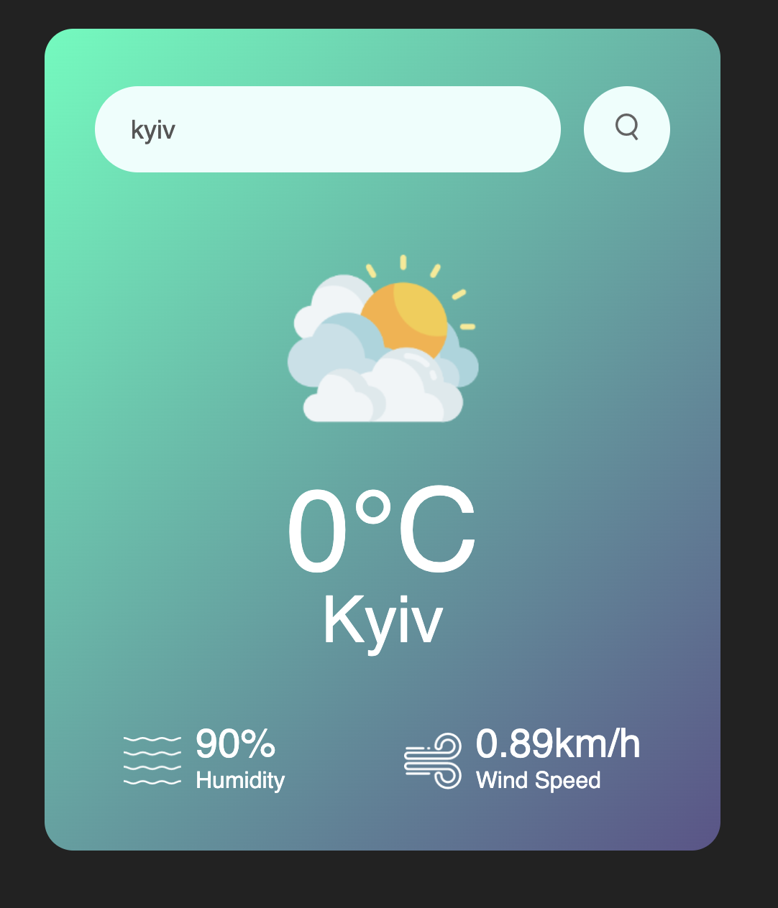

# Weather App

## Description

The Weather App is a simple application that displays current weather
information for a specified location. It fetches real-time weather data using a
public API and presents it in an intuitive interface.

## Features

- **Real-time weather updates**: Displays the current temperature, weather
  conditions, and other relevant data.
- **Search functionality**: Enter a city name to get its weather information.

## Project Structure

```
weather-app-main/
├── index.html       # Main HTML file
├── style.css        # CSS for styling
├── js/              # JavaScript folder
│   └── main.js      # Main application logic
├── images/          # Image assets
├── README.md        # Project documentation
└── .gitignore       # Git configuration file
```

## Installation

1. Clone the repository or download the ZIP file.
   ```bash
   git clone <repository_url>
   ```
2. Navigate to the project directory:
   ```bash
   cd weather-app-main
   ```

## Usage

1. Open `index.html` in any modern web browser.
2. Use the search bar to enter the name of a city.
3. View the weather details displayed on the screen.

## Requirements

- A modern web browser (e.g., Chrome, Firefox, Edge).
- Internet connection for fetching live weather data.

## API

This application uses the [OpenWeatherMap API](https://openweathermap.org/) to
fetch weather data. To use the app:

1. Sign up on OpenWeatherMap to get a free API key.
2. Replace the placeholder API key in the JavaScript file (`js/main.js`) with
   your own key:
   ```javascript
   const apiKey = 'YOUR_API_KEY';
   ```

## Contribution

Feel free to fork the repository and submit pull requests. Contributions are
always welcome!

## Result


